# woStrategy

woStrategy is an independent F1 race-performance analysis project built on
public FastF1 data. It is currently a Monte Carlo-based performance tracker
that aims to estimate underlying team pace by separating fuel effect, track
evolution, tyre degradation, and race noise from lap-time data.

The next development focus is to extend this into race planning and strategy 
decision-support tools.

## 0. Examples

### 0.1 Qualifying performance tracker

```bash
python -m wostrategy.script.quali_performance_tracker \
  --year 2026 \
  --race-range "[1, 8]" \
  --target-team Mercedes \
  --new-tyre-only \
  --last-quali-part-only \
  --allow-lap-time-only \
  --track-evolution-fit exponential \
  --output doc/assets/quali_performance_tracker_2026_1-8_mercedes.png
```

This command writes one plot per result type:

<p>
  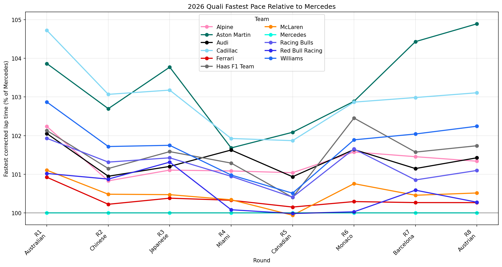
  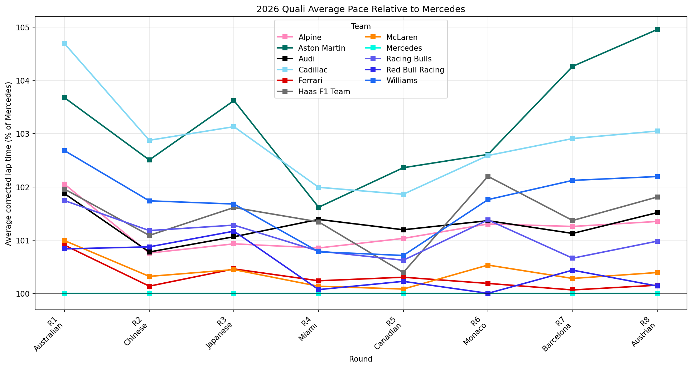
  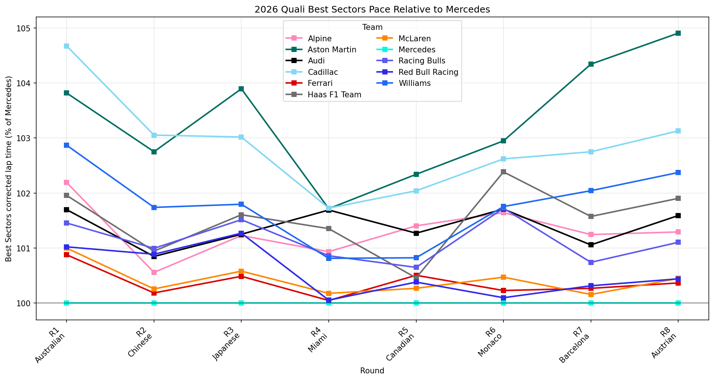
</p>

### 0.2 Race performance tracker

```bash
python -m wostrategy.script.race_performance_review \
  --year 2026 \
  --race "[1, 8]" \
  --session R \
  --sample-count 5000 \
  --sampling-strategy latin-hypercube \
  --fuel-rate-bounds 0 0.10 \
  --track-rate-bounds -0.05 0.05 \
  --limit-negative-track-correction \
  --tyre-deg-bounds 0 0.50 \
  --tyre-delta-bounds -1.0 1.0 \
  --compound-delta-reference HARD \
  --team-variation-fraction 0.5 \
  --team-variation-absolute-min 0.005 \
  --clean-lap-noise-sigma 0.5 \
  --team-baseline-mode average-drivers \
  --reference-team Mercedes \
  --plot-output doc/assets/race_performance_tracker_2026_1-8_mercedes.png \
  --use-cached-monte-carlo
```

This command writes the final team-baseline tracker plot:

<p>
  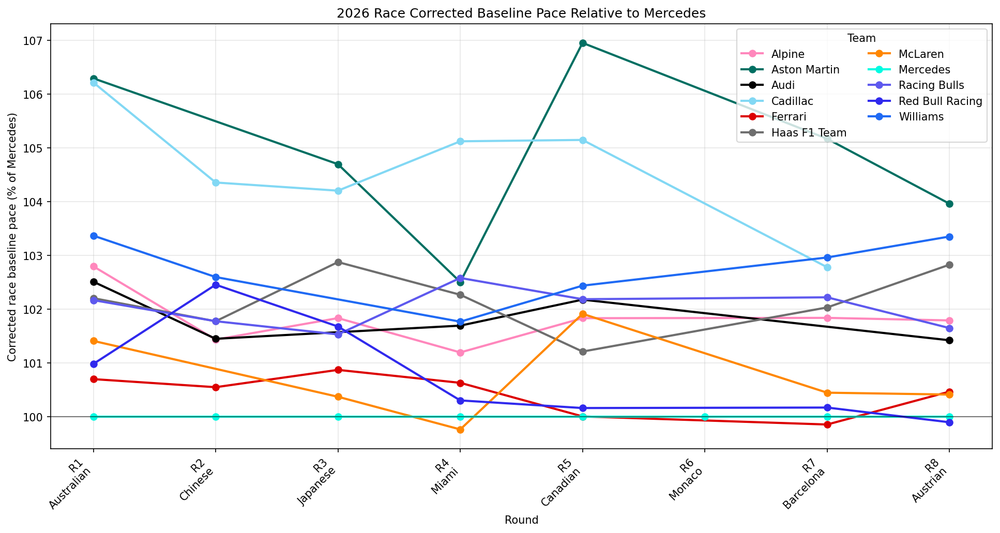
</p>

### 0.3 Pure lap-time trace

```bash
python -m wostrategy.script.pure_lap_time_trace \
  --year 2026 \
  --race 7 \
  --session R \
  --traces-json '{"RUS": {"lap": ["37-61"], "off-set": 0.12}, "HAM": {"lap": ["41-61"], "off-set": 0}}' \
  --delta-traces-json '{"RUS vs HAM": {"trace_a": "RUS", "trace_b": "HAM", "lap": ["7-21"]}}' \
  --y-range 80 83 \
  --output doc/assets/pure_lap_time_trace_2026_7_R.png
```

<p>
  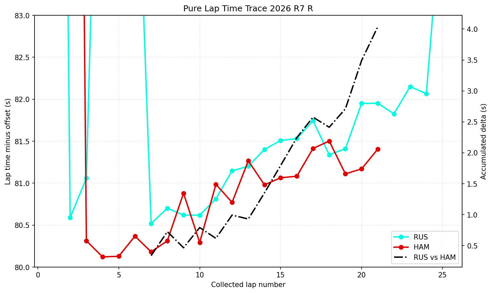
</p>

### 0.4 Race performance weight prediction

```bash
python -m wostrategy.script.race_performance_weight_predict \
  --year 2026 \
  --race "1-8" \
  --session R \
  --team Mercedes \
  --reference-team Mercedes \
  --weight-delta-kg 5 \
  --full-fuel-weight-kg 100 \
  --output doc/assets/race_performance_weight_predict_2026_1-8_mercedes_plus5kg.png
```

<p>
  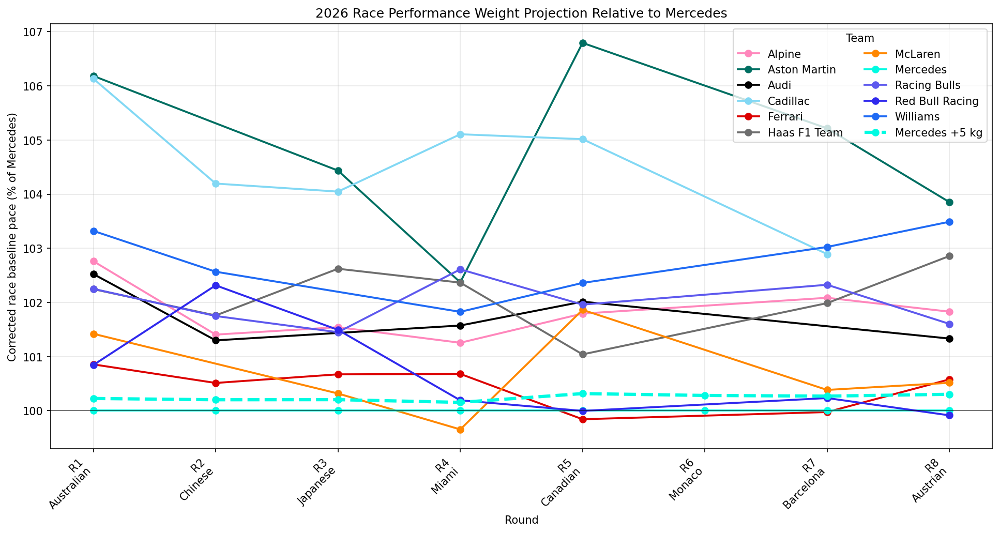
</p>

### 0.5 Tyre strategy summary

```bash
python -m wostrategy.script.tyre_strategy_summary \
  --year 2026 \
  --race 6 \
  --output doc/assets/tyre_strategy_summary_2026_6_R
```

This writes CSV tables and can be rendered as a compact table for review:

<p>
  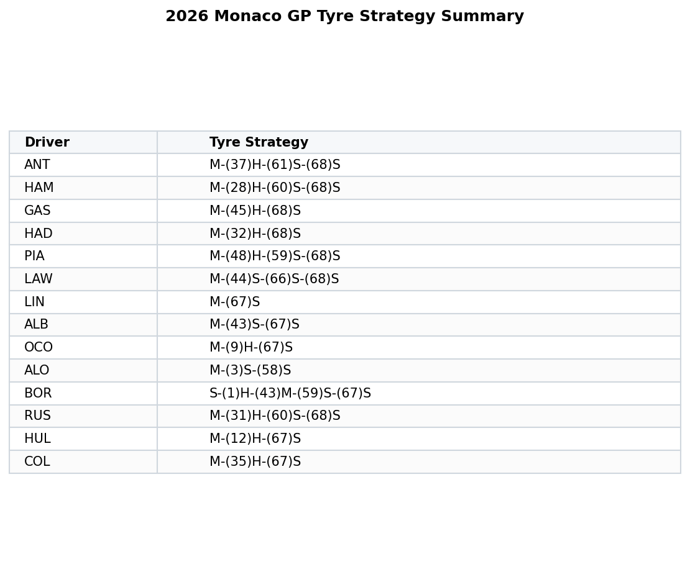
</p>

### 0.6 Pre-season analysis

```bash
python -m wostrategy.script.pre_season_analysis
```

This script writes pre-season plots to `temp/` by default. Example outputs are
shown from `doc/assets`:

<p>
  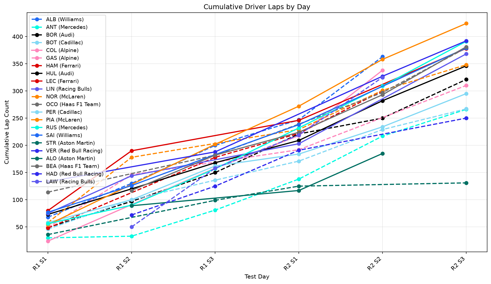
  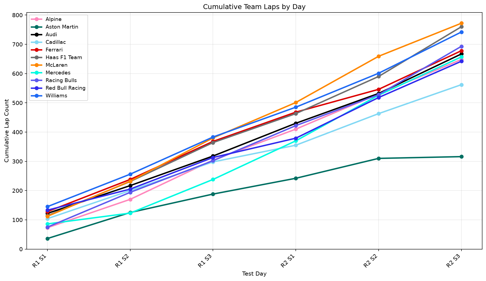
</p>

<p>
  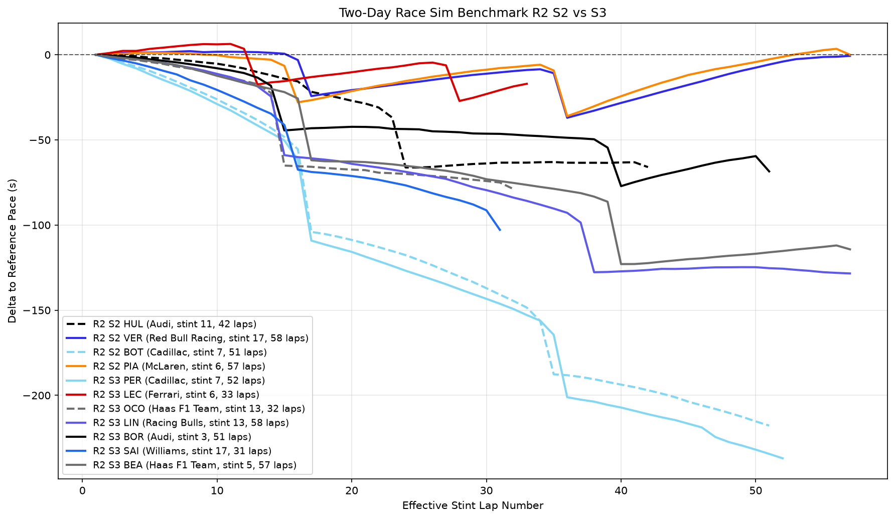
  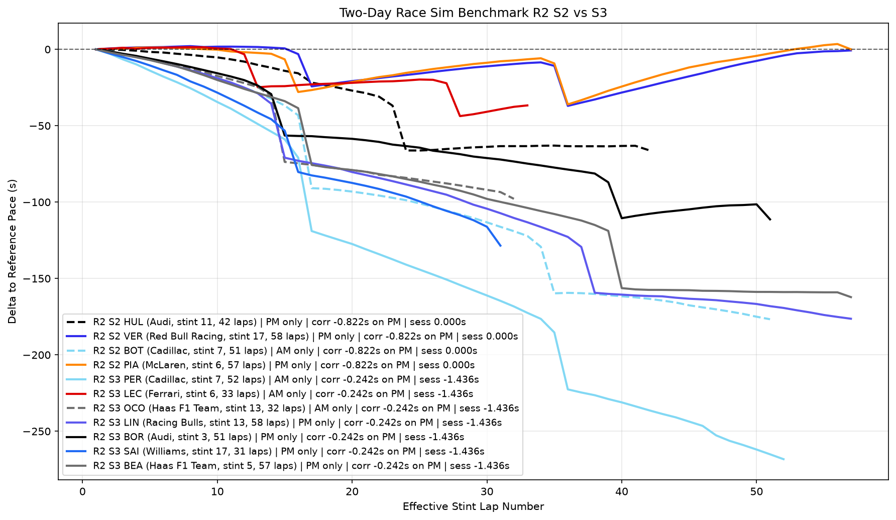
  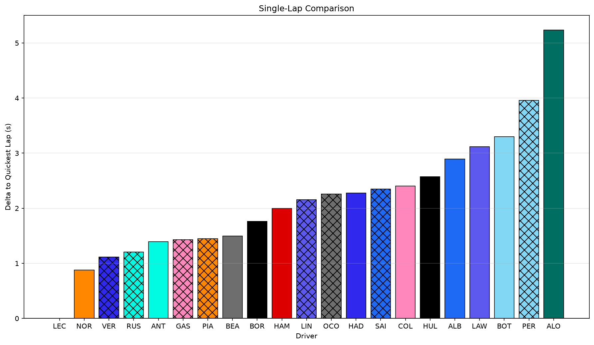
</p>

## 1. Code

### 1.1 Install

```bash
python -m pip install -e .
```

The package depends on `fastf1`, `pandas`, `numpy`, and `matplotlib`. Your
installed FastF1 version determines which events, timing columns, and telemetry
formats are supported.

For development and regression checks:

```bash
python -m pytest
```

### 1.2 Architecture

The package is split into five layers:

```text
model -> algorithm -> analysis -> plots -> script
```

- `wostrategy.model`: small mathematical models and constants, including track
  evolution, fuel proxy columns, tyre-age columns, and long-run model
  experiments.
- `wostrategy.algorithm`: reusable algorithms that should not know about
  FastF1 loading, plotting, or persistence. The Monte Carlo race-performance
  sampler lives here.
- `wostrategy.analysis`: dataframe preparation and domain aggregation. This is
  where push laps, qualifying performance, long-run performance, and race
  performance reviews are calculated.
- `wostrategy.plots`: matplotlib figure rendering.
- `wostrategy.script`: CLI entry points and workflow orchestration.
- `wostrategy.core` and `wostrategy.tools`: session wrappers, FastF1 loading,
  telemetry enrichment, cache handling, and convenience loaders used by the
  analysis scripts.

Example API usage:

```python
from wostrategy import Session, run_two_day_benchmark_race_sim

session = Session(2026, 2, 3, test=True)

result = run_two_day_benchmark_race_sim(
    year=2026,
    round_number=2,
    benchmark_session=2,
    comparison_session=3,
    output_prefix="temp/r2s2_r2s3",
    min_laps=30,
    reference_laps=57,
    test=True,
)
```

## 2. Workflows

### 2.0 Pre-process

The loading layer wraps FastF1 sessions and normalizes the data needed by the
analysis scripts.

- `load_session_laps` loads laps for one or more events and appends `Year`,
  `Round`, `SessionName`, event metadata, session result rank, and per-lap
  weather columns when FastF1 exposes them.
- `load_session_laps_with_telemetry_gap_summary` additionally loads full
  per-lap telemetry, caches it under `cache/telemetry/` by default, and merges
  per-lap clean-air gap metrics back onto the lap dataframe.
- Telemetry cache files are rebuilt automatically when they are empty or miss
  the derived `TimeDeltaToDriverAhead` column.
- Clean-air summaries include min/mean time and distance gaps to cars ahead and
  behind when the data are available.

#### 2.0.1 Distance delta to time delta using interpolation

`DistanceInterpolationTimeDeltaEstimator` converts FastF1's
`DistanceToDriverAhead` telemetry into `TimeDeltaToDriverAhead`.

For each telemetry sample it:

1. Takes the current lap-distance trace: `Distance` versus `Time`.
2. Adds `DistanceToDriverAhead` to the current car distance to get the target
   distance.
3. Wraps targets beyond the lap end and offsets by the lap time.
4. Interpolates the target distance on the current lap trace to estimate when
   the current car would arrive there.
5. Stores the non-negative time difference in seconds.

When synchronized `SessionTime`, `Distance`, and `Speed` samples are available,
gap summaries prefer physical same-session-time car positions. That path derives
nearest cars ahead and behind by circular track distance, which handles lapped
traffic more consistently than inverting `DriverAhead`. If physical samples are
not available, the older `DriverAhead`-based behind-gap fallback is still used.

#### 2.0.2 Other data clean tools

- Push-lap filtering rejects out laps, in laps, non-quick laps, non-clean laps,
  wet/intermediate sessions, and optionally used tyres.
- Race and long-run filtering keeps dry compounds only, removes out/in laps,
  applies driver-relative quick-lap thresholds, and selects clean-air laps by
  front and optional rear mean time gaps.
- Race clean-air selection can use consecutive clean-air chunks or, with
  `--treat-stint-as-whole`, all clean laps in a stint once the stint has enough
  clean laps in total.
- Tyre age can be stint-relative (`--tyre-age-mode stint`, default) or FastF1
  session `TyreLife` based (`--tyre-age-mode overall`).
- Long-run fitting removes obvious lap-time residual outliers inside a stint and
  can remove field-level tyre-slope outliers before team aggregation.
- Wet race/session guards skip workflows when wet/intermediate tyres exceed the
  configured policy.

### 2.1 Quali performance tracker

Qualifying performance estimates team pace after correcting eligible push laps
for track evolution.

#### 2.1.1 Assumptions

- Fuel, tyre degradation, and track evolution are the main lap-time corrections.
  - In qualifying, drivers are assumed to run low fuel, so no fuel correction needed.
  - New-tyre push laps are the default comparison set, so no tyre degradation needed.
- Every eligible push lap contributes the same to the track-evolution fit;
  - with  `--track-evolution-quick-lap-number`, the x-axis can be quick-lap count
  instead of total session lap order.
- Track evolution is assumed to apply the same to all cars.
- Driver error is not explicitly modelled. The workflow partly mitigates this
  by using fastest laps, teammate delta checks, optional best-sector views, and
  last-session selection.

#### 2.1.2 Algorithm

1. Load qualifying laps, preferring telemetry gap summaries for clean-lap
   selection.
2. Fall back to lap-time-only mode only when `--allow-lap-time-only` is set and
   telemetry loading or requested gap columns are unavailable.
3. Add push-lap flags from quick-lap threshold, clean-air gap, out/in lap
   status, and out-push-in run pattern.
4. Keep configured dry compounds and, by default, only new tyres.
5. Fit track evolution from eligible push laps on the dominant compound. The fit
   can be linear or exponential (`y = A * exp(-k x) + B`).
6. Correct lap and sector times to the latest eligible push-lap reference.
7. For the final displayed performance, optionally use only each driver's last
   qualifying part (`--last-quali-part-only`). Track evolution is still fitted
   from all eligible Q1/Q2/Q3 push laps.
8. Aggregate team pace as fastest driver, average of up to two drivers, and
   optional best-sector sum. The average falls back to the faster driver when
   teammate delta exceeds the configured threshold.
9. Plot each team as a percentage of the target team and save a usage CSV with
   the source laps/sectors behind each plotted point.

Example:

```bash
python -m wostrategy.script.quali_performance_tracker \
  --year 2026 \
  --race-range "[1, 8]" \
  --target-team Mercedes \
  --new-tyre-only \
  --last-quali-part-only \
  --allow-lap-time-only \
  --track-evolution-fit exponential
```

Full-range final tracker plots generated for the example above:

<p>
  
  
  
</p>

Push-lap track development is a diagnostic workflow, not the final qualifying
tracker:

```bash
python -m wostrategy.script.push_lap_track_development \
  --year 2026 \
  --race 7 \
  --section Q \
  --new-tyre-only \
  --allow-lap-time-only \
  --track-evolution-fit exponential
```

#### 2.1.3 Problems

- The track-evolution model is intentionally simple. It is currently one shared
  linear or exponential curve, usually fitted on one dominant compound.
- Driver execution error is not modelled directly.
- A dominant compound is required for the track-evolution fit, so mixed-compound
  sessions can be skipped or raise an error.
- Lap-time-only fallback is useful for robustness but cannot identify traffic as
  well as telemetry-derived clean-air filtering.
- Sector correction scales each sector by the lap-level correction ratio; it is
  not a sector-specific track-evolution model.

### 2.2 Race performance tracker

Race performance estimates corrected baseline race pace from clean-air race
laps using weighted Monte Carlo sampling.

#### 2.2.0 Limitation

- Fuel, tyre degradation, and track evolution are the main corrections, which are
  coupled together.
- Race performance must decouple all three from noisy race laps, which is much
  harder than qualifying.
- The current code does not use vehicle modelling. FastF1 public telemetry is
  useful for gap and lap context, but it is not treated as sufficient here for a
  full vehicle model.
- F1 teams can do better with private car, tyre, fuel, and simulator data. This
  project does not have those resources.
- The current choice is a simple weighted Monte Carlo sampler, not a full
  Bayesian MCMC model.

#### 2.2.1 Assumptions

- Fuel correction, track evolution, and tyre degradation are sampled as linear
  rates.
- Fuel rate bounds are non-negative.
- Track evolution can be sampled over configured bounds.
  - Use `--limit-negative-track-correction` to clamp sampled track rates to
  non-negative values.
- Base tyre degradation is sampled per compound, with bounded team-compound
  variation around the compound baseline.
- Compound lap-time delta is estimated separately from degradation, relative to
  `--compound-delta-reference` (`HARD` by default).
- When track temperature is above
  `--degradation-order-track-temperature`, the sampler enforces hot-track tyre
  ordering: `SOFT >= MEDIUM >= HARD` for degradation and
  `SOFT <= MEDIUM <= HARD` for lap-time deltas, where lower delta means faster.
- Driver performance is not explicitly modelled. Baselines can be fitted at
  driver level and then converted to teams by average driver, best driver, or
  direct team baseline mode.

#### 2.2.2 Algorithm

1. Load race laps with telemetry gap summaries. Missing required telemetry gap
   columns skip the race and save diagnostic outputs.
2. Skip wet races when median driver wet/intermediate lap proportion exceeds the
   configured threshold.
3. Prepare dry race laps: remove out/in laps, apply driver-relative quick-lap
   threshold, calculate stint or overall tyre age, and create a fuel proxy from
   laps remaining.
4. Select clean-air laps using average gap to the car ahead and, when
   configured, behind. Selection is either consecutive clean-air chunks or whole
   clean stints.
5. Draw Monte Carlo samples for fuel rate, track rate, compound degradation,
   compound delta, and team-compound degradation variation. Latin hypercube
   sampling is available and is the script default.
6. Correct every clean lap:

   ```text
   corrected =
     lap_time
     - fuel_rate * fuel_proxy_delta
     - track_rate * race_lap_delta
     - team_compound_degradation * tyre_age_delta
     - compound_delta
   ```

7. Fit corrected baselines by driver or team, score each sample by RMSE, and
   convert RMSE to weights. The default `gaussian` weighting is unnormalized;
   `best-rmse-relative` normalizes weights relative to the best RMSE sample.
8. Save weighted P10/median/P90 summaries for fuel, track, compound
   degradation, compound deltas, team-compound degradation, and baseline pace.
9. Convert baselines to team pace and plot each team's weighted median as a
   percentage of the reference team.

Example:

```bash
python -m wostrategy.script.race_performance_review \
  --year 2026 \
  --race "[1, 8]" \
  --session R \
  --sample-count 50000 \
  --sampling-strategy latin-hypercube \
  --fuel-rate-bounds 0 0.10 \
  --track-rate-bounds -0.05 0.05 \
  --limit-negative-track-correction \
  --tyre-deg-bounds 0 0.50 \
  --tyre-delta-bounds -1.0 1.0 \
  --compound-delta-reference HARD \
  --team-variation-fraction 0.5 \
  --team-variation-absolute-min 0.005 \
  --clean-lap-noise-sigma 0.5 \
  --team-baseline-mode average-drivers \
  --reference-team Mercedes \
  --plot-output doc/assets/race_performance_tracker_2026_1-8_mercedes.png \
  --use-cached-monte-carlo
```

Outputs are written to `cache/race_performance_review/` by default, including
clean laps, sampled parameters, degradation samples, compound-delta samples,
baseline samples, team baseline summaries, and sample diagnostics. Use
`--use-cached-monte-carlo` to reuse existing per-race CSVs and calculate only
missing races.

Optional plot controls:

- `--plot-uncertainty-band` draws P10/P90 bands.
- `--plot-rmse-background` shades events by weighted RMSE diagnostics.

Full-range final race tracker plot:

<p>
  
</p>

Race performance weight prediction uses cached race-performance outputs:

```bash
python -m wostrategy.script.race_performance_weight_predict \
  --year 2026 \
  --race "1-8" \
  --session R \
  --team Mercedes \
  --reference-team Mercedes \
  --weight-delta-kg 5 \
  --full-fuel-weight-kg 100
```

## 3. Corrections and additions

Corrections to the requested outline:

- Qualifying does not explicitly correct fuel or tyre degradation; it assumes
  low fuel and usually filters to new-tyre push laps, then corrects track
  evolution.
- The qualifying track-evolution fit can use total session lap order or quick
  lap number. It is not always strictly "total push lap vs lap time" unless that
  option is selected.
- The qualifying final comparison uses each driver's last qualifying part only
  when `--last-quali-part-only` is enabled; this is a presentation/performance
  selection step, not the track-evolution fit scope.
- Race track correction is not forced to be negative in all configurations. The
  script can sample negative and positive track rates, or clamp to non-negative
  with `--limit-negative-track-correction`.
- The race CLI uses `--tyre-deg-bounds` for the default compound degradation
  bounds; `--default-compound-degradation-bounds` is not a valid option.
- The race workflow does not currently implement vehicle modelling. It uses
  telemetry mainly for clean-air gap summaries.
- The Monte Carlo implementation is a weighted random/Latin-hypercube sampler,
  not a full MCMC model.

Additional points included:

- Telemetry cache behavior and automatic stale-cache rebuilds.
- Physical same-session-time clean-air gap summaries for both ahead and behind
  cars, with fallback behavior.
- Wet-session skip policies.
- Tyre-age modes, team baseline modes, compound delta estimation, sample
  diagnostics, cached Monte Carlo reuse, uncertainty bands, and RMSE plot
  backgrounds.
- Durable README plot links now point to `doc/assets/` instead of `temp/`.
