# woStrategy

For the current Race Monte Carlo, live-retro, identifiability, accelerated
evaluator, and production FP tyre-evidence assumptions, see
[`doc/RACE_MC_AND_FP_ARCHITECTURE.md`](doc/RACE_MC_AND_FP_ARCHITECTURE.md).
For the fixed-stop degradation envelope, automatic lower-bound search, result
statuses, and current limitations, see
[`doc/DEGRADATION_CUTOFF.md`](doc/DEGRADATION_CUTOFF.md).
For causal FP session snapshots, rolling degradation calibration, report-only
FP evidence, the performance programme-offset findings, and the deliberate
production compromises, see
[`doc/FP_TYRE_ESTIMATION_STATUS_AND_ROADMAP.md`](doc/FP_TYRE_ESTIMATION_STATUS_AND_ROADMAP.md).

woStrategy is an independent F1 race-performance analysis project built on
public FastF1 data. It is currently a Monte Carlo-based performance tracker
that aims to estimate underlying team pace by separating fuel effect, track
evolution, tyre degradation, and race noise from lap-time data.

The next development focus is to extend this into race planning and strategy 
decision-support tools.

## 0. Examples

### 0.1 Qualifying performance tracker

```bash
python -m wostrategy.script.quali_performance_tracker \
  --year 2026 \
  --race-range "[1, 8]" \
  --target-team Mercedes \
  --new-tyre-only \
  --last-quali-part-only \
  --allow-lap-time-only \
  --track-evolution-fit exponential \
  --output doc/assets/quali_performance_tracker_2026_1-8_mercedes.png
```

This command writes one plot per result type:

<p>
  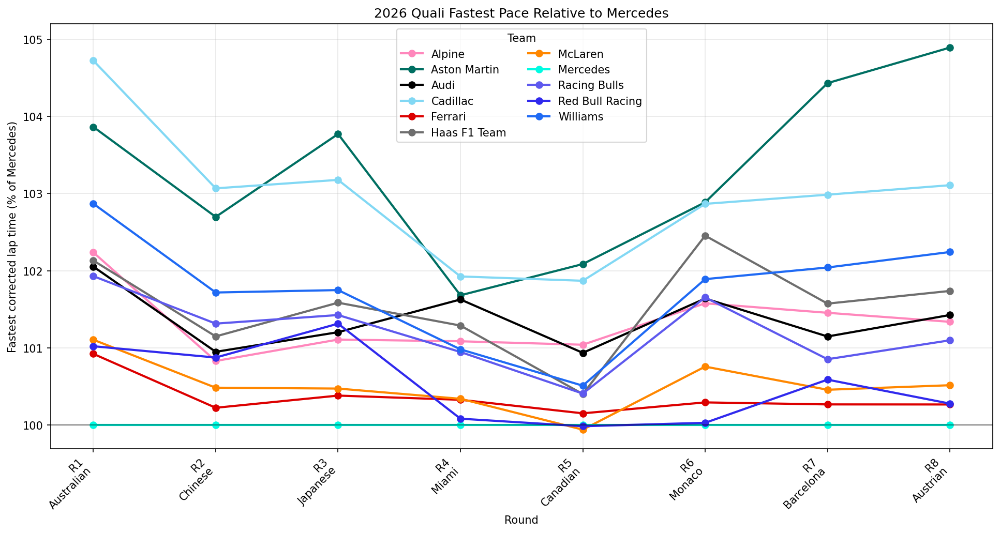
  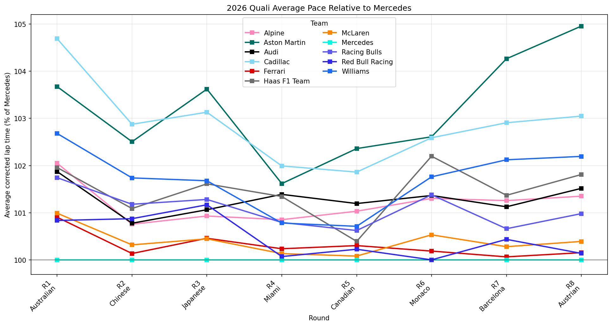
  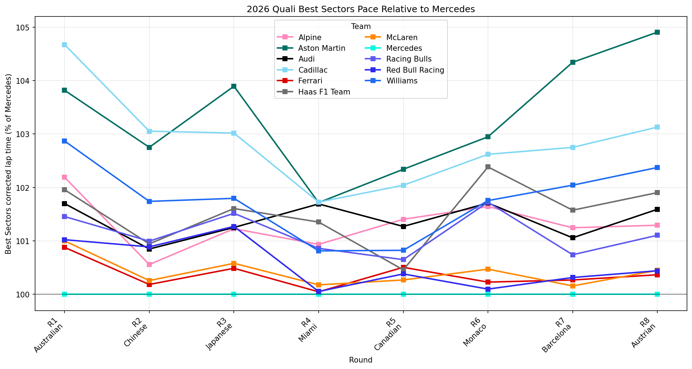
</p>

### 0.2 Race performance tracker

```bash
python -m wostrategy.script.race_performance_review \
  --year 2026 \
  --race "[1, 8]" \
  --session R \
  --sample-count 5000 \
  --sampling-strategy latin-hypercube \
  --fuel-rate-bounds 0 0.10 \
  --track-rate-bounds -0.05 0.05 \
  --limit-negative-track-correction \
  --tyre-deg-bounds 0 0.50 \
  --tyre-delta-bounds -1.0 1.0 \
  --compound-delta-reference HARD \
  --team-variation-fraction 0.5 \
  --team-variation-absolute-min 0.005 \
  --clean-lap-noise-sigma 0.5 \
  --team-baseline-mode average-drivers \
  --reference-team Mercedes \
  --plot-output doc/assets/race_performance_tracker_2026_1-8_mercedes.png \
  --use-cached-monte-carlo
```

Race-scoped lap-compound corrections can be supplied when public timing data
contains a known stint-compound issue:

```bash
python -m wostrategy.script.race_performance_review \
  --year 2026 \
  --race "[1, 10]" \
  --session R \
  --lap-compound-overrides-json '[{"race":10,"driver":"ANT","lap_range":[19,44],"compound":"HARD"}]' \
  --use-cached-monte-carlo
```

Each override must name the race, driver, lap range, and corrected compound.
Only matching races apply the correction and require matching Monte Carlo cache
metadata. Races without a matching override can still reuse existing cached
Monte Carlo results.

This command writes the final team-baseline tracker plot:

<p>
  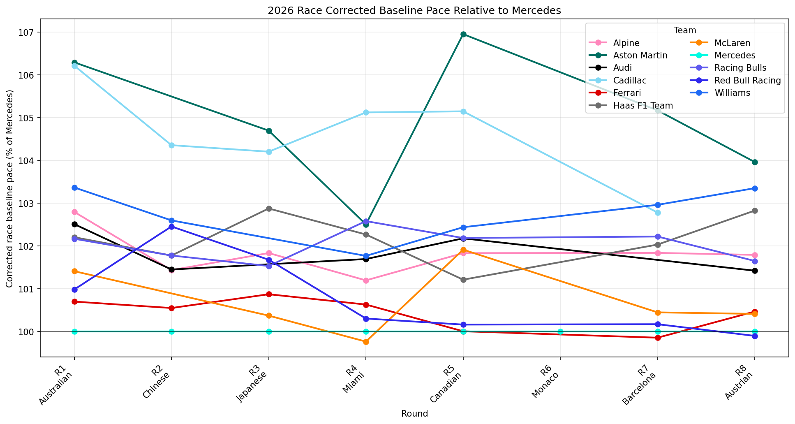
</p>

### 0.3 Pure lap-time trace

```bash
python -m wostrategy.script.pure_lap_time_trace \
  --year 2026 \
  --race 7 \
  --session R \
  --traces-json '{"RUS": {"lap": ["37-61"], "off-set": 0.12}, "HAM": {"lap": ["41-61"], "off-set": 0}}' \
  --delta-traces-json '{"RUS vs HAM": {"trace_a": "RUS", "trace_b": "HAM", "lap": ["7-21"]}}' \
  --y-range 80 83 \
  --output doc/assets/pure_lap_time_trace_2026_7_R.png
```

<p>
  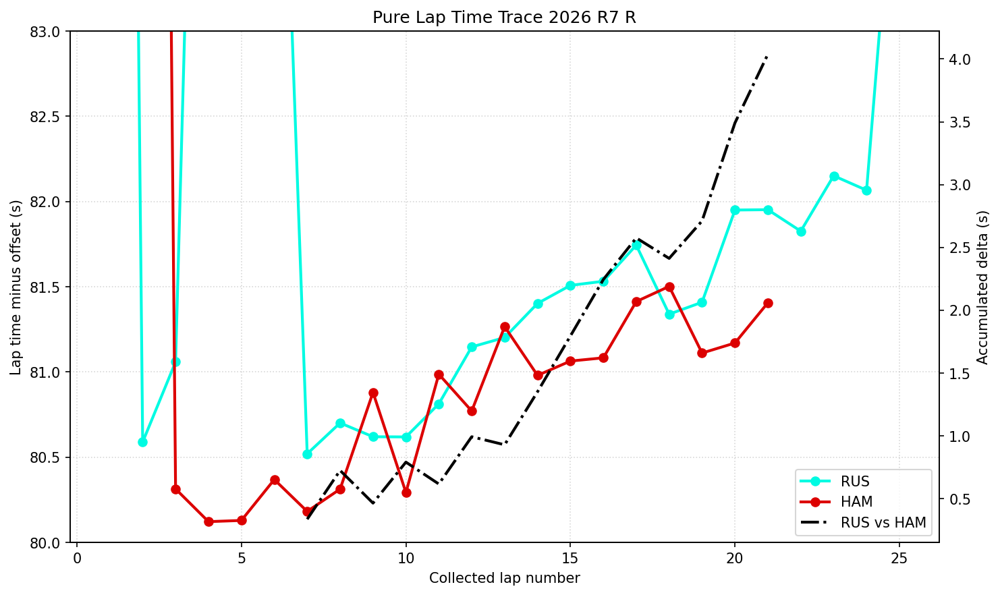
</p>

### 0.4 Race performance weight prediction

```bash
python -m wostrategy.script.race_performance_weight_predict \
  --year 2026 \
  --race "1-8" \
  --session R \
  --team Mercedes \
  --reference-team Mercedes \
  --weight-delta-kg 5 \
  --full-fuel-weight-kg 100 \
  --output doc/assets/race_performance_weight_predict_2026_1-8_mercedes_plus5kg.png
```

<p>
  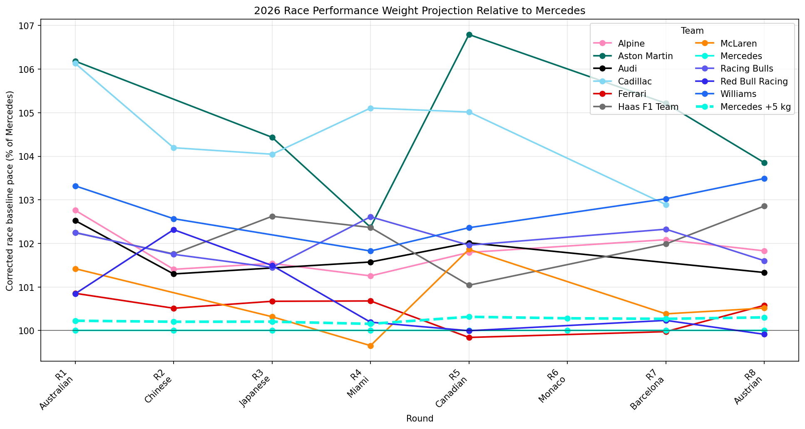
</p>

### 0.5 Tyre strategy summary

```bash
python -m wostrategy.script.tyre_strategy_summary \
  --year 2026 \
  --race 6 \
  --output doc/assets/tyre_strategy_summary_2026_6_R
```

This writes CSV tables and can be rendered as a compact table for review:

<p>
  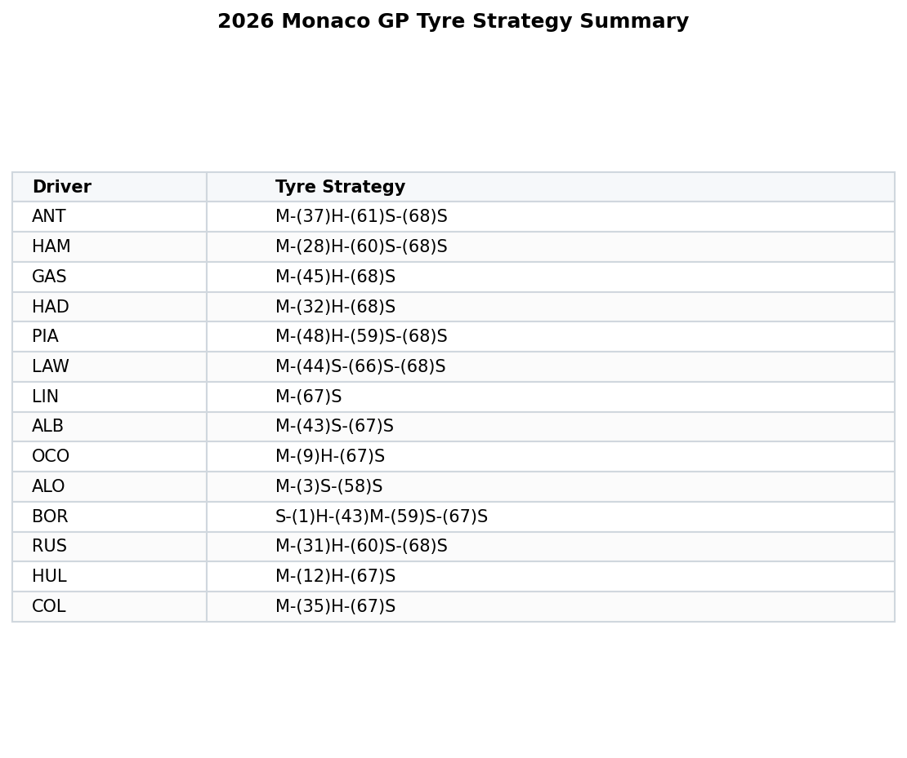
</p>

### 0.6 Pre-season analysis

```bash
python -m wostrategy.script.pre_season_analysis
```

This script writes pre-season plots to `temp/` by default. Example outputs are
shown from `doc/assets`:

<p>
  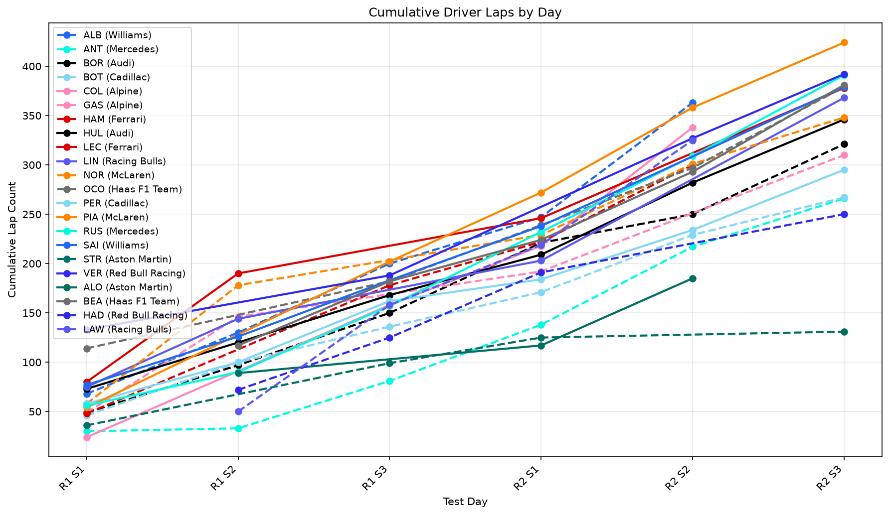
  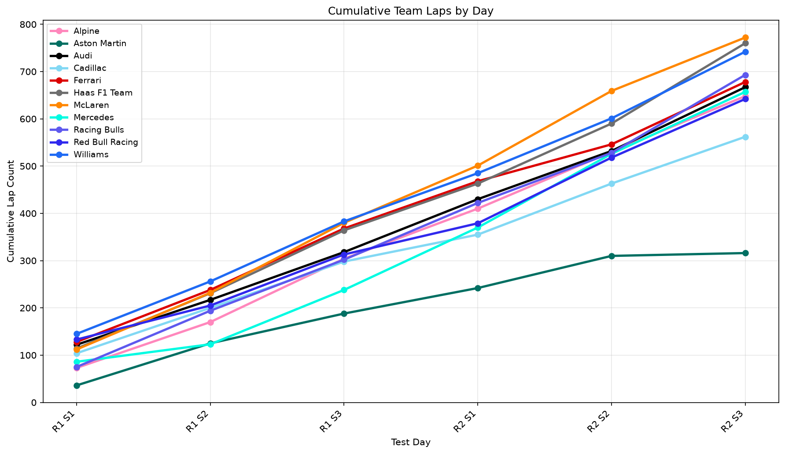
</p>

<p>
  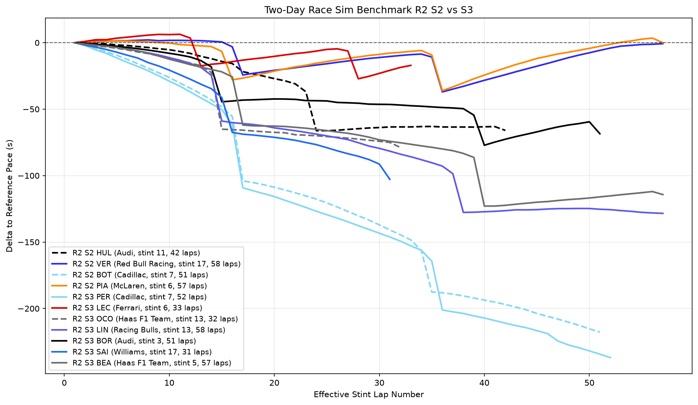
  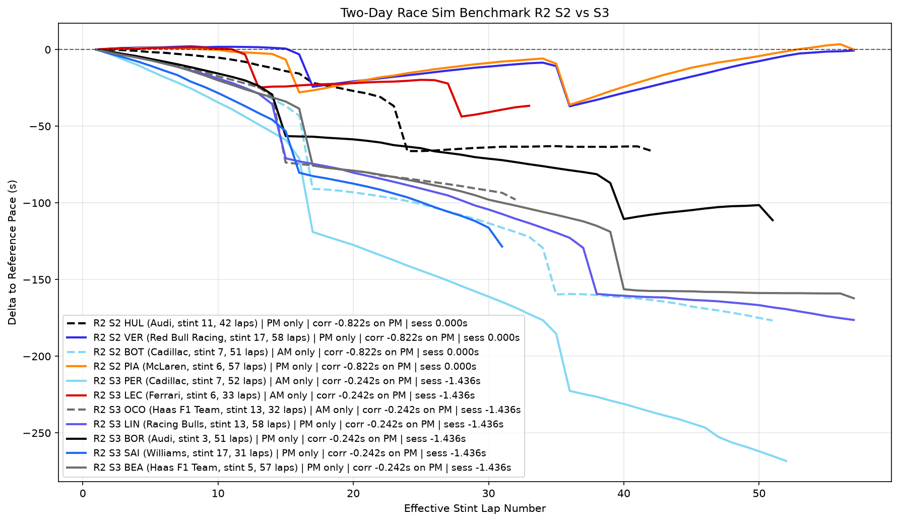
  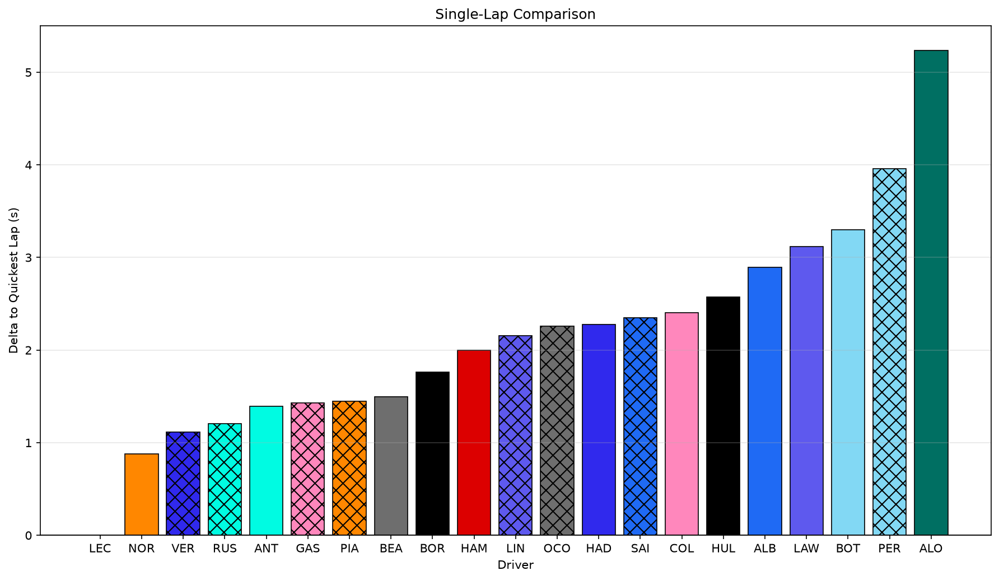
</p>

## 1. Code

### Strategy Prediction weekend model and exact strategy search

Strategy Prediction uses a joint, deterministic Latin-hypercube weekend model
with a shared fuel parameter, session-specific track/tyre parameters, per-run nuisance
intercepts, and an exact top-K dynamic-programming strategy engine. Select any FP
combination in `SCRIPT_CONFIG`; every session is filtered independently and contributes
additively to one joint posterior.

Set `enforce_compound_order` in `SCRIPT_CONFIG` (or use
`--enforce-compound-order`) to constrain every sampled dry-compound candidate to
SOFT ≤ MEDIUM ≤ HARD for baseline lap time and SOFT ≥ MEDIUM ≥ HARD for
degradation. The chosen `reference_compound` remains the zero point for compound
deltas.

```bash
python -m wostrategy.script.pre_race_analysis \
  --year 2026 --round 12 --sessions FP1 FP2 FP3 \
  --sample-count 5000 --reference-compound HARD
```

The strategy APIs are `revalue_fixed_strategy`, `optimise_same_sequence`,
`full_reoptimisation`, and `search_best_continuations`. Tyre age always means completed
laps on the physical set after the last completed lap; the first future lap uses age+1.

For interactive/local use, edit `SCRIPT_CONFIG` near the top of
`src/wostrategy/script/pre_race_analysis.py`, then run the module with no options:

```bash
MPLBACKEND=Agg MPLCONFIGDIR=/private/tmp \
  ../.venv/bin/python -m wostrategy.script.pre_race_analysis
```

The workflow checks enriched session laps under `WODATA_ROOT/fastf1/session_laps/`
first. Cache misses are loaded through FastF1; FastF1's raw cache and derived telemetry
also live below `WODATA_ROOT/fastf1/`. With `primary_seed=None`, a stable event-specific
seed is derived from year and round and reused for the whole weekend.

### 1.1 Install

```bash
python -m pip install -e .
```

The package depends on `fastf1`, `pandas`, `numpy`, and `matplotlib`. Your
installed FastF1 version determines which events, timing columns, and telemetry
formats are supported.

`woStrategy` also depends on the sibling `woData` package for shared data-root
and planner-facing cache path resolution. Team and driver plotting colours also
come from `wodata.colours`, which is populated from FastF1's live-timing
`DriverList`. In the normal local checkout layout:

```text
dr-wo/
  woData/
  woStrategy/
  woPlanner/
```

install development dependencies in dependency order:

```bash
python -m pip install -e ../woData
python -m pip install -e .
```

For development and regression checks:

```bash
python -m pytest
```

### 1.2 Architecture

The package is split into five layers:

```text
model -> algorithm -> analysis -> plots -> script
```

- `wostrategy.model`: small mathematical models and constants, including track
  evolution, fuel proxy columns, tyre-age columns, and long-run model
  experiments.
- `wostrategy.algorithm`: reusable algorithms that should not know about
  FastF1 loading, plotting, or persistence. The Monte Carlo race-performance
  sampler lives here.
- `wostrategy.analysis`: dataframe preparation and domain aggregation. This is
  where push laps, qualifying performance, long-run performance, and race
  performance reviews are calculated.
- `wostrategy.plots`: matplotlib figure rendering.
- `wostrategy.script`: CLI entry points and workflow orchestration.
- `wostrategy.core` and `wostrategy.tools`: session wrappers, FastF1 loading,
  telemetry enrichment, cache handling, and convenience loaders used by the
  analysis scripts.

`woStrategy` remains analysis-only. Interactive GUI and race-planning user
interface code lives in the sibling `woPlanner` project. The dependency
direction is:

```text
woData -> woStrategy -> woPlanner
```

`woStrategy` may import `wodata`, but it must not import `woplanner`.

Example API usage:

```python
from wostrategy import Session, run_two_day_benchmark_race_sim

session = Session(2026, 2, 3, test=True)

result = run_two_day_benchmark_race_sim(
    year=2026,
    round_number=2,
    benchmark_session=2,
    comparison_session=3,
    output_prefix="temp/r2s2_r2s3",
    min_laps=30,
    reference_laps=57,
    test=True,
)
```

## 2. Workflows

### 2.0 Pre-process

The loading layer wraps FastF1 sessions and normalizes the data needed by the
analysis scripts.

- `load_session_laps` loads laps for one or more events and appends `Year`,
  `Round`, `SessionName`, event metadata, session result rank, session start
  position/grid position, and per-lap weather columns when FastF1 exposes them.
- `load_session_laps_with_telemetry_gap_summary` additionally loads full
  per-lap telemetry, caches it under the shared workspace-level
  `dr-wo/cache/telemetry/` directory by default, and merges per-lap clean-air
  gap metrics back onto the lap dataframe.
- Telemetry cache validity includes the traffic evaluator version and selection
  mode; stale or incomplete derived data are rebuilt automatically.
- Clean-air summaries include min/mean time and distance gaps to cars ahead and
  behind when the data are available.

Retrospective, archive-replay, and live paths now pass the same normalized
`Driver`, `SessionTime`, `LapNumber`, and `Speed` contract to the traffic
implementation in `wostrategy.analysis.traffic`. See
[Traffic evaluation](doc/traffic_evaluation.md) for its assumptions, component
outputs, performance model, fallback rules, and finalization semantics.

The race-performance review also writes `latest_resolved_settings.json` before
loading session data. One copy is written at the review root and one in every
requested event/session partition. This records the effective invocation even if
the subsequent session is skipped or fitting fails. A successful cached event's
metadata remains the preferred settings source; otherwise consumers use the
event's latest invocation and then the global latest invocation. This precedence
deliberately favors reproducibility of an existing event result over a newer
unsuccessful command. Only settings compatible with the planner's joint model are
imported; review-only controls such as team-variation fitting are left out rather
than being silently reinterpreted.

#### 2.0.1 Planner-facing race lap cache

`woPlanner` uses `woStrategy` through the narrow planner-facing helper:

```python
from wostrategy import load_race_laps_for_planner

laps = load_race_laps_for_planner(
    year=2026,
    round_number=12,
    session="R",
    data_root="/path/to/woData",  # optional
)
```

This helper loads full race laps and caches them through `woData` using:

```text
<DATA_ROOT>/wostrategy/planner_race_laps/schema_v2/year=<year>/round=<round>/session=<session>/laps.pkl
```

`DATA_ROOT` is resolved by `wodata.get_data_root`:

1. explicit `data_root`
2. `WODATA_ROOT`
3. `WOSTRATEGY_DATA_ROOT`
4. `Path.cwd() / "woData"`

For repeatable local development, prefer setting the shared sibling data root:

```bash
export WODATA_ROOT=/path/to/dr-wo/woData
```

The old local fallback remains readable for compatibility:

```text
<dr-wo>/cache/planner_race_laps/<year>_<round>_<session>.pkl
```

Planner cache files are considered stale and rebuilt when they do not contain
`SessionStartPosition`, because `woPlanner` uses that column for true grid/start
ranking. If FastF1 does not expose grid data, `woPlanner` can still fall back to
first-lap timing, but that is not treated as the preferred start order.

#### 2.0.2 Distance delta to time delta using interpolation

`DistanceInterpolationTimeDeltaEstimator` converts FastF1's
`DistanceToDriverAhead` telemetry into `TimeDeltaToDriverAhead`.

For each telemetry sample it:

1. Takes the current lap-distance trace: `Distance` versus `Time`.
2. Adds `DistanceToDriverAhead` to the current car distance to get the target
   distance.
3. Wraps targets beyond the lap end and offsets by the lap time.
4. Interpolates the target distance on the current lap trace to estimate when
   the current car would arrive there.
5. Stores the non-negative time difference in seconds.

The shared evaluator keeps the finish-line-anchored direct result and the
circular physical result independently visible. The current versioned
`compatibility_min` selector deliberately chooses the smaller available metric,
preserving the historical conservative rule while allowing either component to
be compared or replaced later. Physical circuit phase—not classification lap
difference—is used to locate nearby lapped cars. If telemetry is unavailable or
fails coverage checks, the sector-boundary estimator is selected as a fallback
with explicit method and status provenance.

#### 2.0.3 Other data clean tools

- Push-lap filtering rejects out laps, in laps, non-quick laps, non-clean laps,
  wet/intermediate sessions, and optionally used tyres.
- Race and long-run filtering keeps dry compounds only, removes out/in laps,
  applies driver-relative quick-lap thresholds, and selects clean-air laps by
  front and optional rear mean time gaps.
- Race clean-air selection can use consecutive clean-air chunks or, with
  `--treat-stint-as-whole`, all clean laps in a stint once the stint has enough
  clean laps in total.
- Tyre age can be stint-relative (`--tyre-age-mode stint`, default) or FastF1
  session `TyreLife` based (`--tyre-age-mode overall`).
- Long-run fitting removes obvious lap-time residual outliers inside a stint and
  can remove field-level tyre-slope outliers before team aggregation.
- Wet race/session guards skip workflows when wet/intermediate tyres exceed the
  configured policy.

### 2.1 Quali performance tracker

Qualifying performance estimates team pace after correcting eligible push laps
for track evolution.

#### 2.1.1 Assumptions

- Fuel, tyre degradation, and track evolution are the main lap-time corrections.
  - In qualifying, drivers are assumed to run low fuel, so no fuel correction needed.
  - New-tyre push laps are the default comparison set, so no tyre degradation needed.
- Every eligible push lap contributes the same to the track-evolution fit;
  - with  `--track-evolution-quick-lap-number`, the x-axis can be quick-lap count
  instead of total session lap order.
- Track evolution is assumed to apply the same to all cars.
- Driver error is not explicitly modelled. The workflow partly mitigates this
  by using fastest laps, teammate delta checks, optional best-sector views, and
  last-session selection.

#### 2.1.2 Algorithm

1. Load qualifying laps, preferring telemetry gap summaries for clean-lap
   selection.
2. Fall back to lap-time-only mode only when `--allow-lap-time-only` is set and
   telemetry loading or requested gap columns are unavailable.
3. Add push-lap flags from quick-lap threshold, clean-air gap, out/in lap
   status, and out-push-in run pattern.
4. Keep configured dry compounds and, by default, only new tyres.
5. Fit track evolution from eligible push laps on the dominant compound. The fit
   can be linear or exponential (`y = A * exp(-k x) + B`).
6. Correct lap and sector times to the latest eligible push-lap reference.
7. For the final displayed performance, optionally use only each driver's last
   qualifying part (`--last-quali-part-only`). Track evolution is still fitted
   from all eligible Q1/Q2/Q3 push laps.
8. Aggregate team pace as fastest driver, average of up to two drivers, and
   optional best-sector sum. The average falls back to the faster driver when
   teammate delta exceeds the configured threshold.
9. Plot each team as a percentage of the target team and save a usage CSV with
   the source laps/sectors behind each plotted point.

Example:

```bash
python -m wostrategy.script.quali_performance_tracker \
  --year 2026 \
  --race-range "[1, 8]" \
  --target-team Mercedes \
  --new-tyre-only \
  --last-quali-part-only \
  --allow-lap-time-only \
  --track-evolution-fit exponential
```

Full-range final tracker plots generated for the example above:

<p>
  
  
  
</p>

Push-lap track development is a diagnostic workflow, not the final qualifying
tracker:

```bash
python -m wostrategy.script.push_lap_track_development \
  --year 2026 \
  --race 7 \
  --section Q \
  --new-tyre-only \
  --allow-lap-time-only \
  --track-evolution-fit exponential
```

#### 2.1.3 Problems

- The track-evolution model is intentionally simple. It is currently one shared
  linear or exponential curve, usually fitted on one dominant compound.
- Driver execution error is not modelled directly.
- A dominant compound is required for the track-evolution fit, so mixed-compound
  sessions can be skipped or raise an error.
- Lap-time-only fallback is useful for robustness but cannot identify traffic as
  well as telemetry-derived clean-air filtering.
- Sector correction scales each sector by the lap-level correction ratio; it is
  not a sector-specific track-evolution model.

### 2.2 Race performance tracker

Race performance estimates corrected baseline race pace from clean-air race
laps using weighted Monte Carlo sampling.

#### 2.2.0 Limitation

- Fuel, tyre degradation, and track evolution are the main corrections, which are
  coupled together.
- Race performance must decouple all three from noisy race laps, which is much
  harder than qualifying.
- The current code does not use vehicle modelling. FastF1 public telemetry is
  useful for gap and lap context, but it is not treated as sufficient here for a
  full vehicle model.
- F1 teams can do better with private car, tyre, fuel, and simulator data. This
  project does not have those resources.
- The current choice is a simple weighted Monte Carlo sampler, not a full
  Bayesian MCMC model.

#### 2.2.1 Assumptions

- Fuel correction, track evolution, and tyre degradation are sampled as linear
  rates.
- Fuel rate bounds are non-negative.
- Track evolution can be sampled over configured bounds.
  - Use `--limit-negative-track-correction` to clamp sampled track rates to
  non-negative values.
- Base tyre degradation is sampled per compound, with bounded team-compound
  variation around the compound baseline.
- Compound lap-time delta is estimated separately from degradation, relative to
  `--compound-delta-reference` (`HARD` by default).
- When track temperature is above
  `--degradation-order-track-temperature`, the sampler enforces hot-track tyre
  ordering: `SOFT >= MEDIUM >= HARD` for degradation and
  `SOFT <= MEDIUM <= HARD` for lap-time deltas, where lower delta means faster.
- Driver performance is not explicitly modelled. Baselines can be fitted at
  driver level and then converted to teams by average driver, best driver, or
  direct team baseline mode.

#### 2.2.2 Algorithm

1. Load race laps with telemetry gap summaries. Missing required telemetry gap
   columns skip the race and save diagnostic outputs.
2. Skip wet races when median driver wet/intermediate lap proportion exceeds the
   configured threshold.
3. Prepare dry race laps: remove out/in laps, apply driver-relative quick-lap
   threshold, calculate stint or overall tyre age, and create a fuel proxy from
   laps remaining.
4. Select clean-air laps using average gap to the car ahead and, when
   configured, behind. Selection is either consecutive clean-air chunks or whole
   clean stints.
5. Draw Monte Carlo samples for fuel rate, track rate, compound degradation,
   compound delta, and team-compound degradation variation. Latin hypercube
   sampling is available and is the script default.
6. Correct every clean lap:

   ```text
   corrected =
     lap_time
     - fuel_rate * fuel_proxy_delta
     - track_rate * race_lap_delta
     - team_compound_degradation * tyre_age_delta
     - compound_delta
   ```

7. Fit corrected baselines by driver or team, score each sample by RMSE, and
   convert RMSE to weights. The default `gaussian` weighting is unnormalized;
   `best-rmse-relative` normalizes weights relative to the best RMSE sample.
8. Save weighted P10/median/P90 summaries for fuel, track, compound
   degradation, compound deltas, team-compound degradation, and baseline pace.
9. Convert baselines to team pace and plot each team's weighted median as a
   percentage of the reference team.

Example:

```bash
python -m wostrategy.script.race_performance_review \
  --year 2026 \
  --race "[1, 8]" \
  --session R \
  --sample-count 50000 \
  --sampling-strategy latin-hypercube \
  --fuel-rate-bounds 0 0.10 \
  --track-rate-bounds -0.05 0.05 \
  --limit-negative-track-correction \
  --tyre-deg-bounds 0 0.50 \
  --tyre-delta-bounds -1.0 1.0 \
  --compound-delta-reference HARD \
  --team-variation-fraction 0.5 \
  --team-variation-absolute-min 0.005 \
  --clean-lap-noise-sigma 0.5 \
  --team-baseline-mode average-drivers \
  --reference-team Mercedes \
  --plot-output doc/assets/race_performance_tracker_2026_1-8_mercedes.png \
  --use-cached-monte-carlo
```

Outputs are written to woData by default, partitioned by event:

```text
woData/wostrategy/race_performance_review/schema_v1/
  year=2026/round=8/session=R/
    tyre_information.csv
    race_performance_2026_8_R_*.csv
```

`tyre_information.csv` is the single planner-facing tyre summary. It contains
global and team rows for compound baseline speed, compound delta, degradation,
uncertainty ranges, and sample/weight information. Detailed clean laps, sampled
parameters, degradation and delta samples, baseline samples, team summaries,
and diagnostics remain separate files in the same event directory. This keeps
the convenient summary file small without discarding reproducibility data.
Each successfully recalculated race atomically replaces its own
`year=.../round=.../session=.../tyre_information.csv`; values are never appended
across recalculations or mixed with another race.

Multi-race summaries use a sibling `range=1-8/session=R/` partition. All new
cache writes use woData. When `--use-cached-monte-carlo` finds an older cache in
`dr-wo/cache/race_performance_review/`, it reads and promotes that event into the
canonical woData directory; it does not delete the legacy files. Use
`--use-cached-monte-carlo` to reuse existing per-race CSVs and calculate only
missing races. Races with lap-compound overrides write metadata alongside the
CSV outputs, so stale cached outputs generated without the same correction are
not reused for that race.

### Cross-event tyre prediction

The complete frozen-V1 assumptions, compromises, validation rules, descriptor-domain
diagnostics, dual-output contract, and prospective scoring procedure are documented in
[`doc/CROSS_EVENT_TYRE_PREDICTION_V1.md`](doc/CROSS_EVENT_TYRE_PREDICTION_V1.md).

The downstream tyre-prediction pipeline reads existing Race Retro artifacts without
invoking or changing Retro MC, joins them to validated Pirelli preview descriptors,
checks model readiness, and writes rolling pre-race predictions under
`woData/wostrategy/tyre_prediction/schema_v1/`.

```bash
python -m wostrategy.script.tyre_prediction_pipeline --year 2026
```

Unchanged preview images are served from their SHA256-keyed per-event JSON artifacts.
For a new or changed image, install `wodata[vision]` and pass `--vision-model`, or set
`WODATA_PIRELLI_VISION_MODEL`. API credentials remain provider environment settings.
The V1 performance estimator preserves Retro's event-HARD-relative coordinate; its
readiness is evaluated separately from the absolute degradation estimator. Performance
is fitted as four adjacent C1-C2 through C4-C5 gap intercepts with shared linear tyre
stress and asphalt grip terms. Degradation uses five absolute-compound intercepts with
shared linear stress, abrasion, and grip terms. Neither regression changes Retro's
calculation or saved semantics.

Every run also writes `validation.json` and `validation_predictions.csv`. Validation is
strictly chronological, excludes the performance HARD identity rows from metrics, and
compares each Pirelli feature model with its intercept-only baseline. The three supported
weight policies are `uniform`, `event_normalised`, and
`evidence_event_normalised`. The evidence policy applies `sqrt` to persisted clean-lap
counts by compound and then normalises each event to total weight one; P10/P90 widths
remain diagnostics and are not treated as calibrated inverse variances.

The compatibility default is fixed at P0/uniform for performance and D0/uniform for
degradation; small rolling-metric changes never promote another model automatically.
Every compound also exposes a `historical_baseline` family (P0/D0) and a
`pirelli_informed` family (P1/D1), so the physically informed alternative is visible
rather than hidden. Both families are stored in each immutable prediction version.
Human-readable FP evidence reports render the degradation families as `Historical
degradation` and `Pirelli-informed degradation`; the internal IDs remain unchanged for
artifact and calibration compatibility.
`coefficient_history.csv` records rolling and current
fit coefficients and conditioning, while `diagnostic_summary.json` ranks residuals and
summarises descriptor groups. Once Retro becomes available for a versioned pre-race
prediction, `prospective_validation.csv` scores that original saved P0/P1/D0/D1 output
without recreating it. Prospective and historical-rolling metrics remain separate.

Persisted FP evidence can be evaluated against the later Race Retro target without
changing the production tyre predictor:

```bash
python -m wostrategy.script.fp_race_diagnostic \
  --season 2026 \
  --data-root ../woData
```

The command records direct degradation error, leave-one-compound-out event-K transfer,
team-compound topology, HARD-relative same-team and baseline-corrected cross-team
performance, and constrained joint-fit diagnostics. See
[`doc/CROSS_EVENT_TYRE_PREDICTION_V1.md`](doc/CROSS_EVENT_TYRE_PREDICTION_V1.md#historical-fp-to-race-diagnostic)
for the eligibility contract and artifact layout, and
[`doc/FP_TYRE_ESTIMATION_STATUS_AND_ROADMAP.md`](doc/FP_TYRE_ESTIMATION_STATUS_AND_ROADMAP.md)
for the evolving calibration evidence, reporting policy, and limitations. These outputs
remain diagnostic and are not consumed by Strategy Prediction.

Pirelli descriptor levels remain a V1 ordinal 1-5 numerical approximation. Diagnostics
treat 1 and 5 as saturated boundary categories, record whether each level and exact
descriptor tuple occurred in prior events, and report paired interior/boundary and
seen/unseen-tuple metrics. These fields are descriptive only: they do not measure physical
distance, alter a prediction, change its weight, or trigger model promotion.

Optional plot controls:

- `--plot-uncertainty-band` draws P10/P90 bands.
- `--plot-rmse-background` shades events by weighted RMSE diagnostics.

Full-range final race tracker plot:

<p>
  
</p>

Race performance weight prediction uses cached race-performance outputs:

```bash
python -m wostrategy.script.race_performance_weight_predict \
  --year 2026 \
  --race "1-8" \
  --session R \
  --team Mercedes \
  --reference-team Mercedes \
  --weight-delta-kg 5 \
  --full-fuel-weight-kg 100
```

## 3. Corrections and additions

Corrections to the requested outline:

- Qualifying does not explicitly correct fuel or tyre degradation; it assumes
  low fuel and usually filters to new-tyre push laps, then corrects track
  evolution.
- The qualifying track-evolution fit can use total session lap order or quick
  lap number. It is not always strictly "total push lap vs lap time" unless that
  option is selected.
- The qualifying final comparison uses each driver's last qualifying part only
  when `--last-quali-part-only` is enabled; this is a presentation/performance
  selection step, not the track-evolution fit scope.
- Race track correction is not forced to be negative in all configurations. The
  script can sample negative and positive track rates, or clamp to non-negative
  with `--limit-negative-track-correction`.
- The race CLI uses `--tyre-deg-bounds` for the default compound degradation
  bounds; `--default-compound-degradation-bounds` is not a valid option.
- The race workflow does not currently implement vehicle modelling. It uses
  telemetry mainly for clean-air gap summaries.
- The Monte Carlo implementation is a weighted random/Latin-hypercube sampler,
  not a full MCMC model.

Additional points included:

- Telemetry cache behavior and automatic stale-cache rebuilds.
- Physical same-session-time clean-air gap summaries for both ahead and behind
  cars, with fallback behavior.
- Wet-session skip policies.
- Tyre-age modes, team baseline modes, compound delta estimation, sample
  diagnostics, cached Monte Carlo reuse, uncertainty bands, and RMSE plot
  backgrounds.
- Durable README plot links now point to `doc/assets/` instead of `temp/`.
